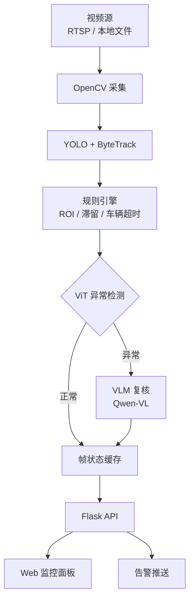

<div align="center">

# Moniter — 多模态 AI 智能视频监控系统

[](https://www.python.org/)
[](https://pytorch.org/)
[](https://flask.palletsprojects.com)
[](LICENSE)

**目标检测 · 异常识别 · 大模型语义复核**

[English Version](README.md)

</div>

---

## Moniter 是什么？

**Moniter** 是一套多模态 AI 驱动的智能视频监控系统，将三级推理串联为统一的实时监控管线：**YOLO 目标检测** → **ViT 视频异常识别** → **VLM 视觉语言模型复核**。

传统系统只能被动录像，而 Moniter 能"看懂"视频：

1. **感知层** — YOLOv8 实时检测画面中的目标（人、车、火灾、烟雾等）。
2. **认知层** — VideoMAE v2 + MIL 分析连续视频片段，识别异常行为。
3. **理解层** — Qwen-VL 对异常片段生成语义描述（如"打架""火灾"）。

面向人群：安防运维人员、AI 研究人员，以及任何需要自动化视频分析的场景。

---

## ✨ 功能亮点

- 🎥 **多路视频接入** — 支持 RTSP 网络流与本地视频文件，Web 端随时增删改查。
- 🧠 **三级 AI 推理** — 检测 → 异常识别 → 语义复核，层层递进。
- 🌐 **精致 Web 监控面板** — Glassmorphism 玻璃拟态 UI，MJPEG 实时流、状态看板、ROI 绘制。
- 📊 **灵活规则引擎** — ROI 禁区闯入、人员滞留、禁现物品、车辆超时告警。
- 🚀 **一键启动** — `python launch.py` 自动启动后端并打开浏览器。

---

## 🚀 快速开始

### 环境要求

- Python >= 3.10
- CUDA >= 11.8（推荐显存 >= 12 GB）
- Windows / Linux

### 安装依赖

```bash
git clone <仓库地址>
cd moniter

conda create -n moniter python=3.10
conda activate moniter

pip install -r yolo/requirements.txt
pip install -r Vit/lab_anomaly/requirements.txt
pip install -r vlm/requirements.txt
pip install Flask
```

### 准备模型权重

| 模型 | 默认路径 | 说明 |
|------|----------|------|
| YOLO | `yolo/logs/best_epoch_weights.pth` | 目标检测权重 |
| ViT | `Vit/lab_dataset/derived/end2end_classifier/checkpoint_best.pt` | 异常检测检查点（准确率 **92.66%**，AUC **98.05%**） |
| VLM | `vlm/outputs/merged/` | 微调后的 Qwen-VL（可选） |

可通过环境变量覆盖：`YOLO_WEIGHTS`、`VIT_CHECKPOINT`、`VLM_MERGED`。

### 一键启动

```bash
python launch.py
```

服务启动后自动打开浏览器访问 `http://127.0.0.1:5000`。

---

## 🏗️ 技术架构



### 三级推理详解

| 层级 | 输入 | 模型 | 输出 |
|------|------|------|------|
| **L1 YOLO** | 单帧图像（640×640） | YOLOv8-L | 边界框、82 类标签、置信度 |
| **L2 ViT** | 16 帧连续片段（224×224） | VideoMAE v2-Base + MIL | 异常概率 + 分类标签 |
| **L3 VLM** | 触发时的视频片段帧 | Qwen-VL（基础或微调） | JSON：`{"classification":"...", "reason":"..."}` |

---

## 📁 项目结构

```
moniter/
├── launch.py                 # 一键启动入口
├── predict.py                # 命令行实时监控入口
├── config.yaml               # 统一配置文件
│
├── yolo/                     # 目标检测模块
├── Vit/                      # 异常检测模块（VideoMAE v2 + MIL）
├── vlm/                      # 视觉语言复核模块（Qwen-VL）
└── web/                      # Flask 监控面板
```

---

## ⚙️ 配置说明

`config.yaml` 关键字段：

| 配置节 | 字段 | 默认值 | 说明 |
|--------|------|--------|------|
| `sources` | `uri`, `type` | — | 视频源列表（file / rtsp） |
| `streams` | `rois` | `[]` | ROI 禁区多边形坐标 |
| `yolo` | `confidence` | `0.3` | 检测置信度阈值 |
| `vit` | `known_checkpoint` | — | ViT 检查点路径 |
| `vit` | `clip_len` | `16` | 每片段帧数 |
| `system` | `alarm_cooldown_sec` | `30` | 告警冷却时间 |
| `system` | `vit_anomaly_threshold` | `0.55` | ViT 异常触发阈值 |

Web 面板支持每路流独立配置。

---

## 📡 API 接口

| 方法 | 端点 | 说明 |
|------|------|------|
| `GET` | `/api/streams` | 列出所有流 + 模型加载状态 |
| `POST` | `/api/streams` | 添加新流 |
| `DELETE` | `/api/streams/<id>` | 删除流 |
| `POST` | `/api/streams/<id>/start` | 启动流 |
| `POST` | `/api/streams/<id>/stop` | 停止流 |
| `PATCH` | `/api/streams/<id>` | 更新配置（阈值、ROI、类别等） |
| `GET` | `/api/streams/<id>/status` | 获取流状态 + ViT/VLM 结果 |
| `GET` | `/video/<id>` | MJPEG 实时视频流 |
| `GET` | `/api/streams/<id>/snapshot` | 获取最新帧 JPEG |

---

## ⚠️ 常见问题

1. **ViT 训练与推理参数必须对齐** — `clip_len`、`window_stride`、`encoder_model` 在训练和推理时必须一致。
2. **类别名大小写敏感** — `config.yaml` 和 Web 端配置中的类别名必须与 `coco_classes_chinese.txt` 中的名称**完全一致**。
3. **Web 版与命令行版是两套入口** — `predict.py` 不走 Flask；`launch.py` / `web/app.py` 才加载 VLM。
4. **VLM 显示"未加载"** — 检查 `vlm/outputs/merged/` 是否存在，可通过环境变量 `VLM_MERGED` 覆盖。

---

## 📄 许可证

[MIT License](LICENSE)

---

<div align="center">

**⭐ 如果本项目对你有帮助，请点一颗 Star！⭐**

</div>
