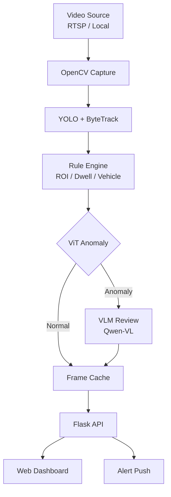

<div align="center">

# Moniter — Multimodal AI Intelligent Video Surveillance System

[](https://www.python.org/)
[](https://pytorch.org/)
[](https://flask.palletsprojects.com)
[](LICENSE)

**YOLO Detection · ViT Anomaly Recognition · VLM Semantic Review**

[中文介绍](README-CN.md)

</div>

---

## What Is Moniter?

**Moniter** is a multimodal AI-powered intelligent video surveillance system that chains three levels of inference — **YOLO object detection**, **ViT video anomaly recognition**, and **VLM vision-language model review** — into a unified real-time monitoring pipeline.

Unlike traditional systems that only record passively, Moniter "understands" video:

1. **Perception Layer** — YOLOv8 detects objects (people, vehicles, fire, smoke) in real time.
2. **Cognition Layer** — VideoMAE v2 + MIL analyzes continuous video clips to identify abnormal behavior.
3. **Understanding Layer** — Qwen-VL generates semantic descriptions (e.g., "fighting", "fire") for anomalies.

Target users: security operators, AI researchers, and anyone needing automated video analysis.

---

## ✨ Highlights

- 🎥 **Multi-source video** — RTSP streams and local files, dynamically managed via Web UI.
- 🧠 **Three-stage AI pipeline** — Detection → Anomaly recognition → Semantic review, progressively refined.
- 🌐 **Elegant Web dashboard** — Glassmorphism UI with MJPEG streams, status boards, and ROI drawing.
- 📊 **Flexible rule engine** — ROI intrusion, dwell time, prohibited objects, vehicle overtime alerts.
- 🚀 **One-click launch** — `python launch.py` starts the backend and opens your browser.

---

## 🚀 Quick Start

### Requirements

- Python >= 3.10
- CUDA >= 11.8 (GPU recommended, >= 12 GB VRAM)
- Windows / Linux

### Install

```bash
git clone <repo-url>
cd moniter

conda create -n moniter python=3.10
conda activate moniter

pip install -r yolo/requirements.txt
pip install -r Vit/lab_anomaly/requirements.txt
pip install -r vlm/requirements.txt
pip install Flask
```

### Prepare Weights

| Model | Default Path | Note |
|-------|-------------|------|
| YOLO | `yolo/logs/best_epoch_weights.pth` | Object detection weights |
| ViT | `Vit/lab_dataset/derived/end2end_classifier/checkpoint_best.pt` | Anomaly checkpoint (Accuracy **92.66%**, AUC **98.05%**) |
| VLM | `vlm/outputs/merged/` | Fine-tuned Qwen-VL (optional) |

Override via environment variables: `YOLO_WEIGHTS`, `VIT_CHECKPOINT`, `VLM_MERGED`.

### Launch

```bash
python launch.py
```

Opens `http://127.0.0.1:5000` automatically.

---

## 🏗️ Architecture



### Pipeline Details

| Layer | Input | Model | Output |
|-------|-------|-------|--------|
| **L1 YOLO** | Frame (640×640) | YOLOv8-L | Boxes, 82 classes, confidences |
| **L2 ViT** | 16-frame clip (224×224) | VideoMAE v2-Base + MIL | Anomaly probability + label |
| **L3 VLM** | Triggered clip frames | Qwen-VL (base or fine-tuned) | JSON: `{"classification":"...", "reason":"..."}` |

---

## 📁 Project Structure

```
moniter/
├── launch.py                 # One-click launcher
├── predict.py                # CLI real-time entry
├── config.yaml               # Unified config
│
├── yolo/                     # Object detection
├── Vit/                      # Anomaly detection (VideoMAE v2 + MIL)
├── vlm/                      # Vision-language review (Qwen-VL)
└── web/                      # Flask dashboard
```

---

## ⚙️ Configuration

Key fields in `config.yaml`:

| Section | Field | Default | Description |
|---------|-------|---------|-------------|
| `sources` | `uri`, `type` | — | Video sources (file / rtsp) |
| `streams` | `rois` | `[]` | ROI polygons |
| `yolo` | `confidence` | `0.3` | Detection threshold |
| `vit` | `known_checkpoint` | — | ViT checkpoint path |
| `vit` | `clip_len` | `16` | Frames per clip |
| `system` | `alarm_cooldown_sec` | `30` | Alert cooldown |
| `system` | `vit_anomaly_threshold` | `0.55` | ViT trigger threshold |

Web panel supports per-stream independent configuration.

---

## 📡 API Endpoints

| Method | Endpoint | Description |
|--------|----------|-------------|
| `GET` | `/api/streams` | List all streams + model status |
| `POST` | `/api/streams` | Add a stream |
| `DELETE` | `/api/streams/<id>` | Remove a stream |
| `POST` | `/api/streams/<id>/start` | Start stream |
| `POST` | `/api/streams/<id>/stop` | Stop stream |
| `PATCH` | `/api/streams/<id>` | Update config (threshold, ROI, classes) |
| `GET` | `/api/streams/<id>/status` | Get status + ViT/VLM results |
| `GET` | `/video/<id>` | MJPEG live stream |
| `GET` | `/api/streams/<id>/snapshot` | Latest frame JPEG |

---

## ⚠️ Common Issues

1. **ViT params must align** — `clip_len`, `window_stride`, and `encoder_model` must match between training and inference.
2. **Case-sensitive class names** — Category names in `config.yaml` and Web UI must exactly match `coco_classes_chinese.txt`.
3. **Web vs CLI** — `predict.py` is local window mode (no Flask); `launch.py` / `web/app.py` is Web mode (loads VLM).
4. **VLM "not loaded"** — Check if `vlm/outputs/merged/` exists. Use `VLM_MERGED` env var to override.

---

## 📄 License

[MIT License](LICENSE)

---

<div align="center">

**⭐ Star this repo if it helps your project! ⭐**

</div>
