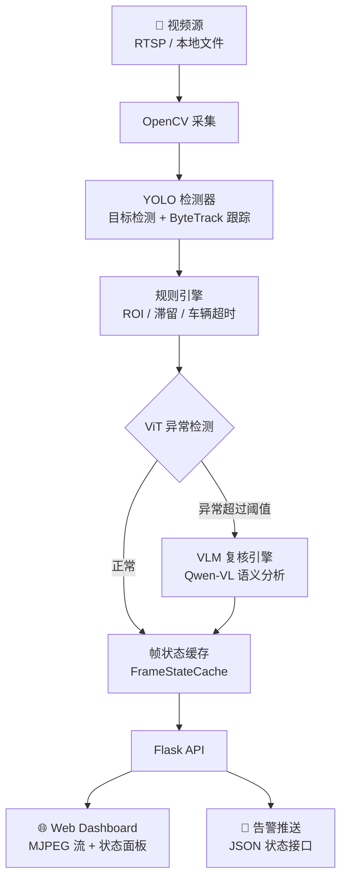
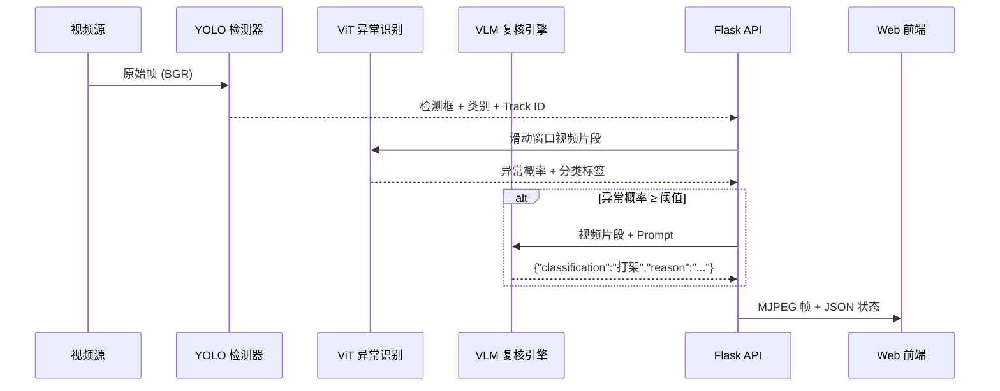

# Moniter — 多模态 AI 智能视频监控系统

[](https://python.org)
[](https://pytorch.org)
[](https://flask.palletsprojects.com)
[](LICENSE)

> **Moniter** 是一套集成多模态大模型的智能视频监控系统，将目标检测（YOLO）、视频异常识别（ViT）与视觉语言模型复核（VLM）串联成三级推理流水线，实现对多路视频流的实时监控、异常检测与语义化告警。

---

## ✨ 功能亮点

- 🎥 **多路视频接入** — 支持 RTSP 网络流与本地视频文件混合输入，Web 端随时增删改查
- 🧠 **三级 AI 推理** — YOLO 目标检测 → ViT 视频异常识别 → VLM 大模型语义复核，层层递进
- 🌐 **精致 Web 监控面板** — Glassmorphism 玻璃拟态 UI，实时 MJPEG 视频流、状态看板、ROI 绘制
- 📊 **灵活规则引擎** — ROI 禁区闯入、人员滞留、禁现物品、车辆超时停留等多维度告警
- 🚀 **一键启动** — `python launch.py` 自动启动后端并打开浏览器
- 📝 **中文原生** — YOLO 标签、VLM 输出、Web 界面全中文，开箱即用

---

## 📖 项目简介

传统视频监控系统只能被动录像，无法主动识别异常行为。**Moniter** 将计算机视觉与大语言模型结合，让监控系统具备"看懂视频"的能力：

1. **感知层** — YOLOv8 实时检测画面中的目标（人、车、物品等）
2. **认知层** — VideoMAE v2 + MIL 分析连续视频片段，判断是否存在异常行为
3. **理解层** — Qwen-VL 视觉语言模型对异常片段进行语义描述，输出"打架""火灾"等结构化结论

系统面向安防运维人员、AI 研究人员及需要自动化视频分析的场景，帮助用户从海量监控录像中快速定位关键事件。

---

## 🚀 快速开始

### 环境要求

- Python >= 3.10
- CUDA >= 11.8（GPU 推理，推荐显存 >= 12GB）
- Windows / Linux

### 安装依赖

```bash
# 克隆仓库
git clone <repo-url>
cd moniter

# 创建虚拟环境并安装核心依赖
conda create -n moniter python=3.10
conda activate moniter

# 安装各模块依赖
pip install -r yolo/requirements.txt
pip install -r Vit/lab_anomaly/requirements.txt
pip install -r vlm/requirements.txt
pip install Flask
```

### 准备模型权重

| 模型 | 默认路径 | 说明 |
|------|----------|------|
| YOLO | `yolo/logs/best_epoch_weights.pth` | 目标检测权重 |
| ViT | `Vit/lab_dataset/derived/end2end_classifier/checkpoint_best.pt` | 异常检测 checkpoint |
| VLM | `vlm/outputs/merged/` | 微调合并后的 Qwen-VL（可选） |

> 可通过环境变量覆盖默认路径：`YOLO_WEIGHTS`、`VIT_CHECKPOINT`、`VLM_MERGED`

### 一键启动

```bash
python launch.py
```

服务启动后会自动打开浏览器访问 `http://127.0.0.1:5000`，即可进入监控面板。

---

## 🏗️ 技术架构

### 系统架构



### 数据流



### 三级推理流水线详解

#### L1 — 感知层：YOLO 目标检测
- **输入**：单帧图像（640×640）
- **模型**：YOLOv8-L（CSPDarknet53 + PANet-FPN + 解耦头）
- **输出**：目标边界框、82 类类别标签（COCO 80 + fire + smoke）、置信度
- **跟踪**：ByteTrack，支持 person / vehicle 独立 ID 空间

#### L2 — 认知层：ViT 视频异常识别
- **输入**：16 帧连续视频片段（224×224，从滑动缓冲区均匀采样）
- **模型**：VideoMAE v2（OpenGVLab/VideoMAEv2-Base）+ MIL（Multiple Instance Learning）头
- **输出**：视频级二分类（normal / anomaly）、异常概率、ranking 分数
- **机制**：滑动窗口异步推理，不阻塞主循环

#### L3 — 理解层：VLM 大模型复核
- **输入**：触发时的视频片段（RGB 帧列表）
- **模型**：Qwen-VL（优先使用微调合并模型，回退基础模型）
- **输出**：结构化 JSON — `{"classification": "打架", "reason": "两人在画面中央发生肢体冲突"}`
- **触发条件**：
  - ViT 判定异常且概率超过阈值
  - 或周期性自动触发（`vlm_auto_interval_sec`，独立于 ViT）

---

## 🛠️ 技术栈

| 技术 | 版本 | 用途 |
|------|------|------|
| Python | 3.10+ | 主语言 |
| PyTorch | 2.3+ | 深度学习框架 |
| transformers | 4.36+ | VideoMAE / Qwen-VL 加载 |
| OpenCV | 4.8+ | 视频捕获、图像处理 |
| Flask | 2.3+ | Web 服务与 REST API |
| ByteTrack | — | 多目标跟踪 |
| Pillow | 10.0+ | 中文标签渲染 |

---

## 📁 项目结构

```
moniter/
├── launch.py                     # 一键启动入口（自动打开浏览器）
├── predict.py                    # 命令行版实时监控入口
├── config.yaml                   # 统一配置文件
├── pyproject.toml                # 项目元数据
│
├── yolo/                         # 目标检测模块
│   ├── yolo.py                   # YOLOv8 推理类
│   ├── train.py                  # YOLO 训练入口
│   ├── logs/                     # 模型权重
│   ├── Class/                    # 类别文件（含中文）
│   └── realtime/                 # 实时管线
│       ├── pipeline.py           # 主循环
│       ├── yolo_batch.py         # 真批量推理
│       ├── bytetrack_wrapper.py  # ByteTrack 跟踪封装
│       └── display.py            # 画框、画轨迹、中文标签
│
├── Vit/                          # 视频异常检测模块
│   ├── lab_anomaly/
│   │   ├── models/               # VideoMAE v2 + MIL 模型定义
│   │   ├── infer/                # 推理运行时
│   │   │   ├── known_event_runtime.py   # 异步实时推理
│   │   │   ├── rtsp_service.py          # 独立 RTSP 服务
│   │   │   └── scoring.py               # checkpoint 加载与融合
│   │   ├── train/                # 端到端训练
│   │   │   └── train_end2end.py  # VideoMAE v2 + MIL 训练
│   │   └── tool/
│   │       └── precompute_clips.py      # 离线预切 clip
│   └── lab_dataset/              # 数据集与产物
│       ├── labels/video_labels.csv
│       └── derived/              # 训练产物 / checkpoint
│
├── vlm/                          # 视觉语言模型模块
│   ├── infer/
│   │   └── vlm_engine.py         # Qwen-VL 推理引擎
│   ├── train/                    # QLoRA 微调
│   ├── configs/
│   │   └── default.yaml          # VLM 配置
│   └── outputs/                  # 训练输出 / 合并模型
│
└── web/                          # Web 监控层
    ├── app.py                    # Flask 入口（11 个 API 端点）
    ├── static/
    │   ├── app.js                # 前端核心逻辑
    │   └── style.css             # Glassmorphism 主题
    ├── templates/
    │   └── index.html            # 监控面板页面
    └── services/
        ├── runtime_manager.py    # 后台总调度（YOLO + ViT + VLM 串联）
        ├── frame_state.py        # 帧状态缓存
        ├── stream_store.py       # 流配置持久化
        └── vlm_review_runtime.py # VLM 复核线程管理
```

---

## ✨ 功能详情

### 视频接入
- 支持 RTSP 网络摄像头与本地 `.mp4` / `.avi` 文件
- Web 端可动态添加、删除、启停视频流
- 流配置持久化到 `web/config/streams.json`

### 目标检测与跟踪
- **82 类目标**：COCO 80 类 + `fire`（火灾）+ `smoke`（烟雾）
- **中文标签**：画框标签使用 PIL 渲染，避免 OpenCV 中文乱码
- **ByteTrack 跟踪**：同一路视频中目标保持稳定的 Track ID
- **独立 ID 空间**：人（1+）、车（10000+）、其他（负 ID）

### 规则引擎
| 规则 | 说明 |
|------|------|
| ROI 禁区 | 自定义多边形禁区，指定类别闯入即告警 |
| 人员滞留 | 目标在 ROI 内停留超过阈值时间触发 |
| 禁现物品 | 全局画面中出现指定类别即告警 |
| 车辆超时 | 车辆在画面内停留超过阈值时间触发 |
| 告警冷却 | 同一规则 30 秒内不重复触发 |

### 异常检测（ViT）
- 基于 VideoMAE v2 预训练权重，端到端训练 MIL 分类头
- 三阶段渐进解冻训练策略（head → 最后 2 层 → 最后 4 层）
- 异步推理线程，不影响实时视频流帧率
- 输出：异常概率 + 分类标签 + ranking 分数

### 大模型复核（VLM）
- Qwen-VL 视觉语言模型，支持基础模型与微调模型自动切换
- 强制中文 JSON 输出：`{"classification": "...", "reason": "..."}`
- 双触发机制：ViT 异常触发 + 周期性自动触发
- Web 面板中以可折叠卡片展示 VLM 结论

### Web 监控面板
- **实时视频**：MJPEG 流，每路独立播放
- **状态看板**：每路流的运行状态、ViT 结果、VLM 结论
- **ROI 绘制**：在视频帧快照上绘制多边形禁区
- **精致 UI**：Glassmorphism 玻璃拟态设计，卡片悬停动画
- **设置弹窗**：每路流独立配置阈值、类别、ROI、VLM 开关

---

## 🧠 模型说明

| 模块 | 模型架构 | 默认路径 | 环境变量覆盖 |
|------|----------|----------|--------------|
| **YOLO** | YOLOv8-L<br/>(CSPDarknet53 + PANet-FPN + Decoupled Head) | `yolo/logs/best_epoch_weights.pth` | `YOLO_WEIGHTS` |
| **YOLO 类别** | 82 类（COCO 80 + fire + smoke）| `yolo/Class/coco_classes.txt` | `YOLO_CLASSES` |
| **ViT** | VideoMAE v2-Base + MIL<br/>(16帧 → 768维 → Attention Pooling) | `Vit/lab_dataset/derived/end2end_classifier/checkpoint_best.pt` | `VIT_CHECKPOINT` |
| **VLM** | Qwen-VL（基础或 QLoRA 微调合并）| `vlm/outputs/merged/`（优先）<br/>`vlm/Qwen/`（回退） | `VLM_MERGED`<br/>`VLM_BASE` |

> **注意**：YOLO 类别文件中的中文类别名（如 `人`、`汽车`、`火灾`）必须与 `config.yaml` 和 Web 端规则配置中的名称完全一致，否则规则不会触发。

---

## ⚙️ 配置说明

### `config.yaml` 关键字段

| 节 | 字段 | 说明 | 默认值 |
|---|------|------|--------|
| `sources` | `id`, `uri`, `type` | 视频源列表（file / rtsp）| — |
| `streams` | `rois` | 每路流的禁区多边形坐标 | `[]` |
| `streams` | `roi_alarm_classes` | ROI 闯入告警类别 | `人` |
| `streams` | `global_alarm_classes` | 全局禁现类别 | `猫, 狗` |
| `streams` | `vehicle_alarm_classes` | 车辆超时类别 | `汽车, 卡车, 公交车, 摩托车` |
| `streams` | `vehicle_alarm_sec` | 车辆超时阈值（秒）| `10.0` |
| `yolo` | `model_path` | YOLO 权重路径 | `yolo/logs/...` |
| `yolo` | `classes_path` | 类别文件路径 | `yolo/Class/coco_classes_chinese.txt` |
| `yolo` | `confidence` | 检测置信度阈值 | `0.3` |
| `vit` | `known_checkpoint` | ViT checkpoint 路径 | `Vit/lab_dataset/...` |
| `vit` | `clip_len` | 每片段帧数 | `16` |
| `vit` | `window_stride` | 滑窗步长 | `4` |
| `system` | `max_batch` | YOLO 批量大小 | `4` |
| `system` | `alarm_cooldown_sec` | 告警冷却时间 | `30.0` |
| `system` | `dwell_warning_sec` | 滞留告警阈值 | `5.0` |
| `system` | `vit_anomaly_threshold` | ViT 异常阈值 | `0.55` |
| `tracker` | `track_high_th` | 跟踪高分阈值 | `0.5` |
| `tracker` | `match_thresh` | 匹配阈值 | `0.5` |

### Web 端流级配置

每路流在 Web 面板中可独立配置：

| 配置项 | 说明 |
|--------|------|
| `yolo_confidence` | YOLO 检测置信度阈值 |
| `vit_threshold` | ViT 异常触发阈值 |
| `agent_enabled` | 是否启用 VLM 复核 |
| `vlm_auto_interval_sec` | VLM 周期性自动触发间隔（秒，0 为关闭）|
| `rois` | ROI 禁区多边形 |
| `roi_alarm_classes` | ROI 闯入告警类别 |
| `global_alarm_classes` | 全局禁现类别 |

修改后保存会自动重启后端管线实时生效。

---

## 📡 API 文档

### 流管理

| 方法 | 端点 | 说明 |
|------|------|------|
| `GET` | `/api/streams` | 列出所有流 + 模型加载状态 |
| `POST` | `/api/streams` | 添加新流 |
| `DELETE` | `/api/streams/<id>` | 删除流 |
| `POST` | `/api/streams/<id>/start` | 启动流 |
| `POST` | `/api/streams/<id>/stop` | 停止流 |
| `PATCH` | `/api/streams/<id>` | 更新流配置（阈值、ROI、类别等）|
| `GET` | `/api/streams/<id>/status` | 获取流状态 + ViT/VLM 结果 |

### 视频与数据

| 方法 | 端点 | 说明 |
|------|------|------|
| `GET` | `/video/<id>` | MJPEG 实时视频流 |
| `GET` | `/api/streams/<id>/snapshot` | 获取最新帧 JPEG（用于 ROI 绘制）|
| `GET` | `/api/classes` | 获取所有可检测类别列表 |

---

## 🖥️ 使用方式

### 方式 A：Web 监控面板（推荐）

适合多路监控与远程查看。

```bash
python launch.py
```

- 自动启动 Flask 服务（默认端口 5000）
- 3 秒后自动打开浏览器
- 在面板中添加 RTSP 地址或本地视频路径
- 每路流独立配置规则、阈值、ROI

### 方式 B：本地窗口版

适合调试检测链路。

```bash
python predict.py --config config.yaml
```

- 读取 `config.yaml` 中的视频源和规则配置
- 弹出 OpenCV 窗口展示检测结果
- 同时运行 YOLO + ByteTrack + ViT

### 方式 C：只跑 YOLO + 规则

适合暂时不需要 ViT/VLM 的场景。

```bash
python yolo/run_realtime.py
```

- 纯目标检测 + 跟踪 + 规则告警
- 资源占用最低

---

## ⚠️ 常见问题

### 1. ViT 训练与推理参数必须对齐

`clip_len`（每片段帧数）、`window_stride`（滑窗步长）、`encoder_model`（编码器名称）在训练和推理时必须一致，否则效果下降或直接报错。

### 2. 类别名大小写敏感

`config.yaml` 和 Web 端配置中的类别名（如 `人`、`汽车`、`火灾`）必须与 `coco_classes_chinese.txt` 中的名称**完全一致**（包括大小写），否则规则引擎不会触发。

### 3. Web 版与命令行版是两套入口

- `predict.py` — 本地窗口版，不走 Flask
- `web/app.py` / `launch.py` — Web 版，只有 Web 版才会加载 VLM

### 4. VLM 显示"未加载"

检查 `vlm/outputs/merged/` 目录是否存在有效的 Qwen-VL 合并模型。也可通过环境变量 `VLM_MERGED` 指定其他路径。

### 5. 浏览器缓存

前端 CSS/JS 更新后，需要按 `Ctrl + F5` 强制刷新才能看到最新样式。

### 6. Meta Tensor 修复

VideoMAE v2 的 `pos_embed` 在某些 transformers 版本下可能残留 meta tensor。代码中已包含自动修复逻辑（重建正弦位置编码），通常无需手动处理。

---

## 📄 License

本项目采用 [MIT License](LICENSE) 开源。

---

> 如果你在使用过程中遇到问题，欢迎提交 Issue 或 PR。
