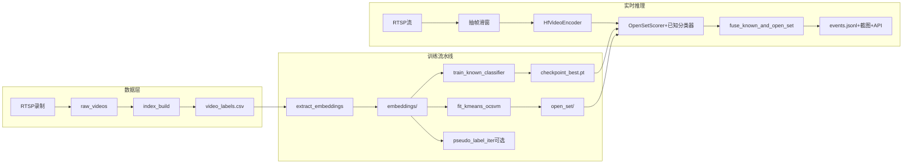

# 代码功能识别报告

> 想按步骤「从看懂到能改」可跟做 [lab_anomaly 学习流程任务](lab_anomaly学习流程任务.md)。

## 一、项目定位

**lab_anomaly**：面向实验室/监控场景的**视频异常检测与分类**流水线。支持：
- **已知异常分类**：识别已标注类别（如 intrusion、fall、fire_smoke 等）
- **开放集异常检测**：发现“没见过”的异常（仅用 normal 样本训练 KMeans + One-Class SVM）
- **实时 RTSP 推理**：从摄像头拉流 → 抽帧/滑窗 → 模型推理 → 事件日志/截图/可选 HTTP 上报

---

## 二、目录与模块功能

| 模块 | 路径 | 功能摘要 |
|------|------|----------|
| **数据** | [lab_anomaly/data/](../lab_anomaly/data/) | 视频索引、标注 CSV、clip 采样、RTSP 录制、视频读取与预处理 |
| **模型** | [lab_anomaly/models/](../lab_anomaly/models/) | 视频 ViT 编码器（HuggingFace VideoMAE）、MIL 分类头（多 clip 汇总为视频级预测） |
| **训练** | [lab_anomaly/train/](../lab_anomaly/train/) | 提 embedding、已知分类器训练、KMeans+OCSVM 开放集、伪标签迭代 |
| **推理** | [lab_anomaly/infer/](../lab_anomaly/infer/) | 开放集打分、已知+开放集融合、RTSP 实时服务（去抖、events.jsonl、截图、API） |
| **配置** | [lab_anomaly/configs/](../lab_anomaly/configs/) | YAML 示例：embedding、伪标签迭代、RTSP 服务 |
| **数据集约定** | [lab_dataset/](../lab_dataset/) | raw_videos、labels/video_labels.csv、derived（embeddings/已知分类器/open_set/实时输出） |

---

## 三、数据流与训练/推理流程

- **标注约定**：`video_labels.csv` 中 `label` 取 `normal`（正常）、具体异常类名、或 `unknown`（占位）。开放集仅使用 `normal`；`unknown` 默认不参与训练。
- **Clip 采样**：每条视频按 `clip_len`、`frame_stride`、`num_clips_per_video` 均匀采样多个 clip，每个 clip 经 ViT 得到一维 embedding，再经 MIL 汇总为视频级预测或用于开放集打分。

---

## 四、核心技术点

1. **视频编码**：[lab_anomaly/models/vit_video_encoder.py](../lab_anomaly/models/vit_video_encoder.py) 使用 HuggingFace `MCG-NJU/videomae-base`，将多帧 clip 编码为固定维度的 embedding。
2. **已知分类**：基于预提的 clip embedding，用 [lab_anomaly/models/mil_head.py](../lab_anomaly/models/mil_head.py)（attention 或 top-k pooling）做视频级多类别分类，训练脚本 [lab_anomaly/train/train_known_classifier.py](../lab_anomaly/train/train_known_classifier.py)。
3. **开放集检测**：[lab_anomaly/train/fit_kmeans_ocsvm.py](../lab_anomaly/train/fit_kmeans_ocsvm.py) 仅用 `normal` 的 embedding：KMeans 聚类 → 每簇（或全局）训练 One-Class SVM → 用分位数得到阈值；推理时 [lab_anomaly/infer/scoring.py](../lab_anomaly/infer/scoring.py) 的 `OpenSetScorer` 计算 anomaly score 并与阈值比较。
4. **融合策略**：[lab_anomaly/infer/scoring.py](../lab_anomaly/infer/scoring.py) 中 `fuse_known_and_open_set`：已知分类置信度低可视为 unknown，再与开放集异常分数结合。
5. **实时服务**：[lab_anomaly/infer/rtsp_service.py](../lab_anomaly/infer/rtsp_service.py)：按配置的 `sample_fps` 抽帧、滑窗成 clip、编码 → 打分与融合 → 按 `min_consecutive` + `cooldown_sec` 去抖 → 写 `events.jsonl`、可选截图、可选 HTTP POST。

---

## 五、推荐使用顺序（与 readme 一致）

1. 准备 `video_labels.csv`（index_build + 人工改 label）。
2. 提 embedding：`extract_embeddings` → `lab_dataset/derived/embeddings/`。
3. 训练已知分类器：`train_known_classifier` → `checkpoint_best.pt`。
4. 训练开放集：`fit_kmeans_ocsvm`（仅 normal）→ `lab_dataset/derived/open_set/`。
5. 可选：`pseudo_label_iter` 增强已知分类器。
6. 部署：修改 [lab_anomaly/configs/rtsp_service_example.yaml](../lab_anomaly/configs/rtsp_service_example.yaml) 中的 `rtsp_url`、`artifacts.known_checkpoint`、`artifacts.open_set_dir`，运行 `python -m lab_anomaly.infer.rtsp_service --config ...`。

---

## 六、依赖与环境

- 主要依赖见 [lab_anomaly/requirements.txt](../lab_anomaly/requirements.txt)：`torch`、`torchvision`、`opencv-python`、`transformers`、`scikit-learn`、`joblib`、`PyYAML` 等。
- 首次使用 ViT 会从 HuggingFace 拉取 `MCG-NJU/videomae-base`；离线环境需提前缓存模型。

---

## 七、小结

| 维度 | 说明 |
|------|------|
| **输入** | 本地视频（按目录组织）+ 标注 CSV；或 RTSP 流（录制或实时推理） |
| **输出** | 训练产物：embedding 目录、已知分类器 checkpoint、开放集 KMeans/OCSVM 与阈值；推理：events.jsonl、截图、可选 HTTP 上报 |
| **典型场景** | 实验室/监控场景下“已知异常类别识别 + 未知异常发现”，并支持 RTSP 实时告警 |

整体上，这是一套**视频级异常检测与分类 + RTSP 实时服务**的完整流水线，从数据准备、特征提取、已知/开放集建模到在线推理均有对应模块与配置示例。
